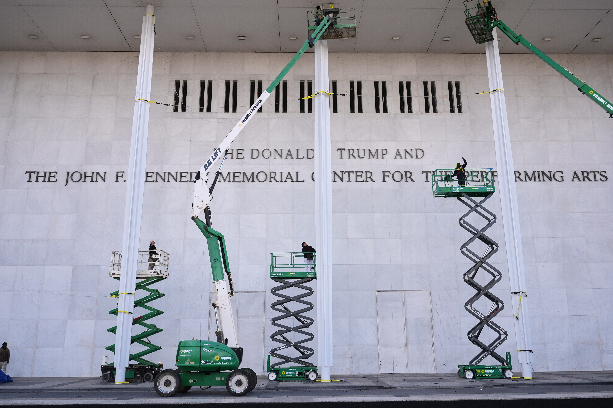

# The Trump Kennedy Center: Why This Matters

- _By Michael L. Thompson using Perplexity.ai (Labs mode)_
- *"The Trump Kennedy Center: Why This Matters" [Kennedy-Renaming-Synopsis-include.md] © 2025 by [Michael L. Thompson](https://www.linkedin.com/in/mlthomps), generated using [Perplexity.ai](https://perplexity.ai), is licensed under CC BY-SA 4.0. To view a copy of this license, visit http://creativecommons.org/licenses/by-sa/4.0/*

---

*Source: [Jacquelyn Martin/AP, via NPR](https://www.npr.org/2025/12/18/nx-s1-5648519/kennedy-center-name-change-trump)*

---

## A Crisis of American Democratic Norms

When the Kennedy Center board voted on December 18, 2025 to rename the institution the "Trump Kennedy Center," it triggered something unprecedented in American history. Not because a sitting president's name was added to a federal building—that had never happened before. Not because of mere partisan disagreement. But because the action revealed something troubling about how power operates when there's no one willing to stop it.

The question isn't whether this was unusual. It was. The real question is whether it's harmless, as the White House claims. The answer, after careful investigation, is no. This renaming represents genuine harm to American democracy—harm that operates on multiple levels at once.

## A Law, Plain and Simple

Start with the legal foundation. In 1964, Congress passed Public Law 88-260, designating the Kennedy Center as "the sole national memorial to the late John Fitzgerald Kennedy within the city of Washington and its environs." That word—"sole"—matters. Congress was saying: this building, in this city, will be the single place we officially memorialize this president.

The building's name appears in federal statute. 20 U.S.C. § 76i reads: "The John F. Kennedy Center for the Performing Arts." Not "may be named." Not "currently named subject to change." It's established in law.

Moreover, in 1983, Congress passed another statute prohibiting "additional memorials or plaques" to JFK without explicit Congressional approval. This wasn't accidental. It was deliberate protection of the integrity of the memorial.

Constitutional law professors from Georgetown and George Washington University confirmed what the statutes clearly state: renaming the Kennedy Center requires Congressional action. The board does not have this authority. Multiple legal scholars stated plainly that what happened was illegal.

Yet the White House installed the sign anyway—literally the day after the board vote, before any legal challenge could be filed.

This is not a gray area of law. This is a statute that says one thing, and an action that violates it.

## Two Centuries of Tradition

But the legal violation, while serious, is only the beginning. The deeper issue involves something Americans have done consistently for over 200 years: honor their leaders after death, not before.

Consider the pattern:

- George Washington died in 1799. The Washington Monument wasn't completed until 1884—85 years later.
- Abraham Lincoln was assassinated in 1865. The Lincoln Memorial wasn't dedicated until 1922—57 years after his death.
- Thomas Jefferson died in 1826. The Jefferson Memorial wasn't built until 1943—117 years later.
- Ronald Reagan left office in 1989. Reagan National Airport wasn't renamed until 1998—nine years after he left office.

Not once in American history has a sitting president named a federal memorial after himself.

This pattern is not accidental. It reflects something deeper: an understanding that memorials belong to the dead, that power and humility go together, and that naming something after yourself while you're still alive signals something troubling—a kind of vanity that looks more like autocracy than democratic leadership.

The Kennedy Center was established during JFK's presidency but named after his assassination in 1963. The timing matters. In American tradition, you don't get a national memorial until you're gone.

Trump is the first president in U.S. history to change that.

## The Kennedy Family's Grief

The response from the Kennedy family provides a window into what this means beyond law and tradition. Maria Shriver called it "beyond wild." Joe Kennedy III said it was "beyond comprehension." Kerry Kennedy, John F. Kennedy's daughter, was direct: "Three and one half years from today I'm going to grab a pickax and take those letters off that building."

These aren't abstract complaints. They're expressions of something real: the sense that their father's memory—and by extension, the memory of a president assassinated for his country—has been appropriated for personal branding.

The Kennedy Center was meant to be what JFK stood for: a space where Americans could come together through the arts, where democracy expressed itself through culture, where shared national values superseded individual ambition. Adding Trump's name to that building changes its meaning. It says: this is not just a memorial to JFK anymore. It belongs equally to someone who used his power to place his name on it.

For the Kennedy family, that's not a minor symbolic shift. It's a desecration.

## How Power Works When No One Says No

The mechanics of what happened reveal something important about institutional capture. Trump's team had strategically replaced Kennedy Center board members with loyalists. During the vote, which was conducted virtually, Democratic board member Joyce Beatty says she was muted—unable to speak or vote against the proposal. The White House subsequently claimed the vote was "unanimous."

Within hours of the vote, before any legal challenge could be filed, workers appeared at the Kennedy Center and affixed Trump's name to the building's facade.

This is how institutional capture works. You pack the board with people loyal to you. You control the rules of engagement. You act before anyone can respond legally. You present the accomplished fact to the world.

The Kennedy Center, which was supposed to be independent—a cultural institution serving all Americans—became a tool for presidential self-promotion.

## The Precedent Problem

Perhaps most troubling is what this action opens the door to. If a president can rename the Kennedy Center without Congressional authority, what else can be renamed? 

Indeed, Trump has already begun. He also renamed the U.S. Institute of Peace to the "Donald J. Trump Institute of Peace." There have been proposals to rename the Department of Defense to the "Department of War." The administration has floated "Trump cards" for immigrants and "Trump accounts" for children's savings.

This isn't about individual actions. It's about the systematic use of state power to promote personal branding. If the Kennedy Center renaming stands unchallenged, it establishes a precedent that future presidents will follow. Institutions that should belong to the nation become monuments to individual presidents.

The harm multiplies across time.

## The Justification That Doesn't Hold

The White House has claimed that Trump "saved" the Kennedy Center from financial crisis. The center was "in terrible condition," the argument goes. Trump's intervention prevented disaster.

This claim hasn't survived scrutiny. The Kennedy Center's previous leadership—people who actually ran the institution—disputed this narrative. They point out that the center received federal funding and has been stable. The "financial crisis" story appears to be a post-hoc justification for an action decided long before.

Even if Trump had rescued the Kennedy Center financially, that wouldn't justify what happened. When major donors contribute to institutions, they don't get to unilaterally rename them. There's a process. There's respect for institutional integrity. There's consent from stakeholders—including, in this case, the family of the person being memorialized.

None of that happened here.

## What Gets Lost

Memorials serve a function in democracies. They're places where we honor sacrifice and service, where we mark what we value as a nation. When a president is assassinated—when someone dies in service to the country—we set aside a space to remember that sacrifice.

But that only works if the memorial remains what it was meant to be. If it gets repurposed for the personal promotion of the sitting president, it loses its power. It becomes just another branded real estate property.

The Kennedy Center isn't just a building. It's where Americans gather to experience shared culture. It represents the idea that we have common ground beyond politics. Adding Trump's name fundamentally changes that. It says: this isn't shared space anymore. This is one person's monument.

## Breaking the Unwritten Rules

Democrats and Republicans have disagreed about many things, but they've generally agreed on certain unwritten rules. You don't lock up political opponents. You respect election results. You follow the law even when you disagree with it. You accept that power is temporary and constrain yourself accordingly.

The Kennedy Center renaming breaks one of those unwritten rules: the rule that when you're in power, you don't use it to aggrandize yourself through public institutions.

It's a small rule in some ways. But small rules matter. They're what hold democracies together when formal institutions fail.

## The Bottom Line

Is the renaming of the Kennedy Center unprecedented? Yes. Is it harmless? No.

It's illegal—it violates federal statute that explicitly requires Congressional action.

It's culturally harmful—it breaks a 200-year American tradition of posthumous memorialization.

It's institutionally harmful—it demonstrates that when power is concentrated, laws become optional and cultural norms are irrelevant.

It's personally harmful to the Kennedy family, who had no say in the desecration of their father's memorial.

And it's harmful to all of us, because it establishes a precedent: federal institutions can be renamed by the sitting president for personal branding, regardless of law, tradition, or consent.

When all of those harms operate together, the claim that this is "harmless" becomes difficult to sustain. The question isn't whether this is unprecedented. The question is whether we have institutions with the will to stop it, and whether we still believe that law and tradition matter.

That question remains open. But the harm is real.

---

**_The full intellectually honest analysis of this proposition, from which this synopsis was generated, is at this Google Drive folder:_** [**"Kennedy-Center-Analysis"**](https://drive.google.com/drive/folders/1JHiqGdQ0t9OiYn1VVCJMfvS-fW_v3YXK?usp=sharing).

- **_The full analysis report is_** **["Kennedy-Center-Analysis_wchanges.pdf"](https://drive.google.com/file/d/1NfQTQ_8eJn6JJg_PFtrIDkqn3Y3jmQ-A/view?usp=sharing).**

**_The guiding treatise for this analysis was this:_** [**"Intellectual-Honesty_rev-3.pdf"**](https://drive.google.com/file/d/1a1kWi9O42awqfXg_8pdJwB4F7autrrUx/view?usp=sharing).
