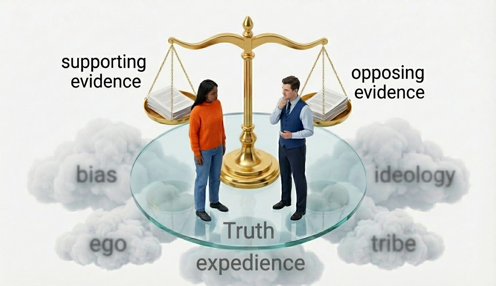

*Intellectual honesty unites us in a shared truth: weighing ideas fairly, correcting mistakes openly, and putting curiosity above ego, bias, expedience, ideology, and tribe.*

---

Welcome to my new blog "Intellectual Honesty". A place where you can read about topical issues discussed within the "Bayesian Framework of Intellectual Honesty" (BFIH) -- or "beefy".

My goal is to promote a pragmatic, operational framework for being intellectually honest in thinking, decision making and discourse. That's what BFIH is all about. And what I hope to spread by you, my readers, instilling the principles of BFIH presented to you in the posts to this blog.

## The Importance of Intellectual Honesty

**So, what do I mean by "Intellectual Honesty"?** The framework I impose is detailed in this treatise: ["A Treatise on Intellectual Honesty: Principles and Practice for Rigorous Inquiry"](https://drive.google.com/file/d/1a1kWi9O42awqfXg_8pdJwB4F7autrrUx/view?usp=sharing).

From the treatise itself:

> Intellectual honesty is the commitment to seek, present, and evaluate information and arguments according to consistent, transparent standards, irrespective of personal bias, vested interests, or desired outcomes.
>
> It demands:
>
> - **Accuracy**: Faithful and undistorted reporting of claims and data.
> - **Fairness**: Giving serious consideration to opposing views and counter-evidence.
> - **Transparency**: Disclosing all relevant assumptions, uncertainties, methods, and conflicts of interest.
> - **Accountability**: Owning errors, correcting them, and updating beliefs as new evidence warrants.
>
> **Why It Matters**    
>
> - **Builds trust and credibility**: Honest discourse establishes confidence in conclusions and makes work replicable.
> - **Fosters reproducibility and transparency**: Transparent methods and assumptions allow others to verify, challenge, or extend findings.
> - **Accelerates error correction and epistemic progress**: Open acknowledgment of uncertainties and mistakes enables collective learning.
> - **Shields against logical fallacies and motivated reasoning**: Confronting disconfirming evidence and examining one's reasoning systematically prevents cherry-picking and rationalization.

## My Approach

I generated that treatise with the help of [Perplexity.ai](https://perplexity.ai), which uses the Large Language Model (LLM) artificial intelligence (AI) tools from Google, OpenAI, Anthropic, etc.  And the analyses that I'll present in each post to this blog will leverage these LLMs -- esp. the reasoning models. When I apply these AI systems, I leverage the LLMs augmented with the system's agentic tool capabilities of internet search, academic literature search, Python coding, image generation, curated document-based RAG (retrieval augmented generation), etc.  In all analyses, the bulk of the work is done by the AI system.  

**So, Why should you bother reading AI slop?**  Yes, AI slop: AI-generated content that is consequentially inaccurate, hallucination-riddled, and untethered to principles of any underlying theory (i.e., just talk, no knowledge). 

**The quick answer is: Don't waste time on AI slop! Spend time on human-crafted research augmented with AI tools.  That's what this blog is.**  

Over the past 3 years, I've created and repeatedly revised the BFIH process.  The entire methodology employed by the AI system is dictated by the context engineering that I do. That is the curated documents, structured prompting, and multi-round create-critique-revise (CCR) cycles I impose upon the system.  I then verify the sources cited by the AI system within its analysis, which, for me, the most valuable yet time-consuming part of the entire process. Finally, when I've verified content from the sources that the AI system cites, and I've gathered all of the documents generated by the AI system, I manually compose and edit them into two main documents:

1. Synopsis -- a plain language 4- to 5-page article that will serve as the body of most posts to this blog.
2. Full Analysis Report -- a more technical, source-cited document serving as the audit trail used to validate that the AI system has rigorously adhered to BFIH.

## Why Trust This Stuff

I haven't formally validated the stability and reliability of these analyses. But I have, to varying degrees over the years and done so informally to different extents, taken the following measures:

- performed each analysis multiple times with the same base LLMs to assess reproducibility,
- switched between AI systems (Perplexity, Google AI Studio, Anthropic Claude, OpenAI ChatGPT) to judge the robustness of BFIH,
- contrasted with my own human-generated analyses to compare comprehensiveness and quality, and 
- executed ablation studies to contrast the extensive context engineer vs. simple one-off prompting and RAG-less generation. 

Again, only done informally, but I've concluded that it is the extensive context engineering I do and subsequent human verification of sources and source content that makes these BFIH analyses rise above AI slop.   

**I've crafted these analyses leveraging an AI system to accelerate and make more thorough a process refined over years of use to yield accurate, reliable, and principle-bound results. So, in short, I think these blog posts deserve your attention!**

## Plan for the Blog

My plan is to focus each post on a single topic. And, along with the reports, supply you with links to the raw documents and transcripts of the sessions with the AI systems that generated the documents. Maybe you'll want to generate similar BFIH analyses on topics of interest for yourself.  

But to begin with, I'd like to give you a set of examples that illustrate what I mean and what being intellectually honest through BFIH entails.

## Today's Topics

So here are today's topics, with links to the Synopsis and the Full Analysis Report to each.

* "Kennedy Center Renaming"
  - [Synopsis](https://drive.google.com/file/d/1fwBpSJI_XldDIjXQJ7i1qcDo3JbDfCU4/view?usp=sharing)
  - [Full Analysis Report](https://drive.google.com/file/d/1NfQTQ_8eJn6JJg_PFtrIDkqn3Y3jmQ-A/view?usp=sharing)
* "Tom Brady, NFL GOAT?"
  - [Synopsis]()
  - [Full Analysis Report]()
* "An AI Bubble?"
  - [Synopsis]()
  - [Full Analysis Report]()

---

Thank you for your time and mindshare,

-Michael L. Thompson ([LinkedIn profile](https://www.linkedin.com/in/mlthomps))

<ul>
  
    <li>
      <a href="{{ post.url }}">{{ post.title }}</a>
    </li>
  
</ul>

