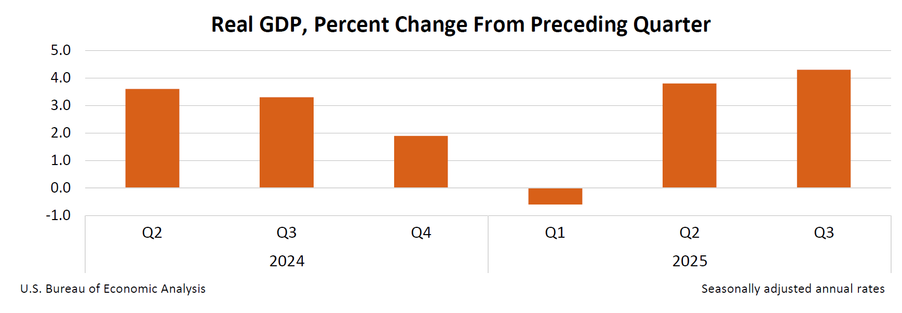

*The latest USA GDP results.*

---

Today, I explored the validity of the latest US federal government release of US economic performance showing Q3 GDP annualized growth rate of 4.3%.

Color me skeptical. Given the interference by the Trump administration with previously non-partisan government agencies -- including firing the Director of Labor Statistics when the numbers weren't to the president's liking -- I can't see how anyone would trust economic numbers coming from the US federal government anymore.  
So, I put this proposition through the BFIH analysis process with Perplexity.ai in "Research" mode.

**The upshot:** BFIH questions the data, too.

Below is its plain-language synopsis of its findings, followed by a link to the full BFIH analysis.

---



---

Thank you for your time and mindshare,

-Michael L. Thompson ([LinkedIn profile](https://www.linkedin.com/in/mlthomps))
