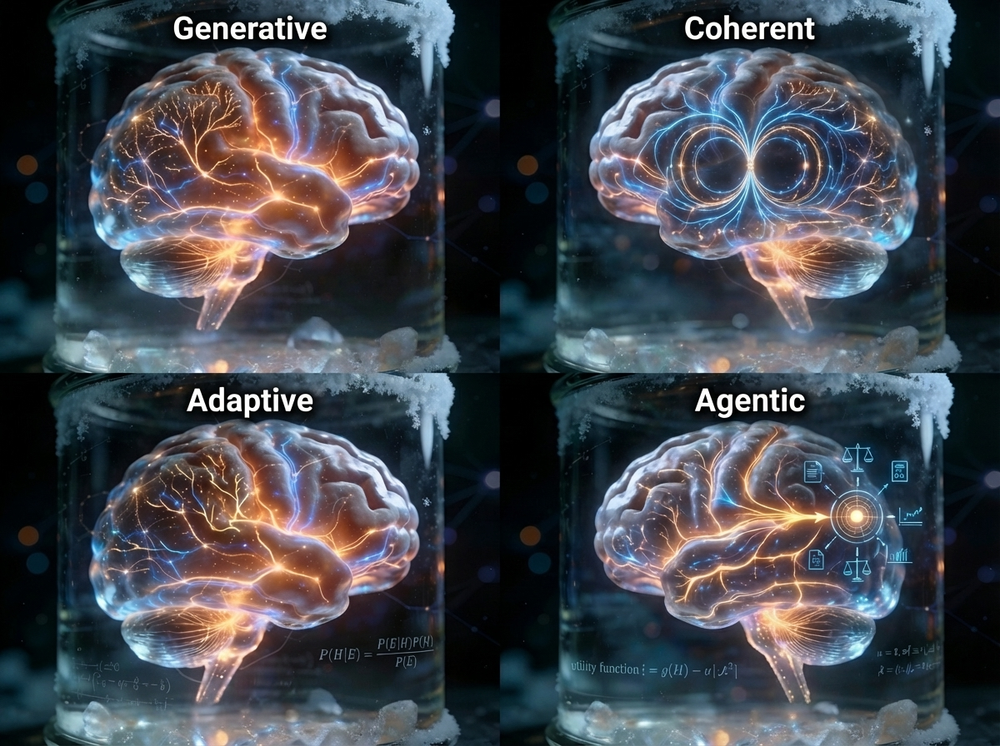

*Bayesian framing as **G**enerative, **C**oherent, **A**daptive, and **A**gentic. (generated by [Google Nano Banana Pro 3.0](https://aistudio.google.com/)).*

---

Back in the 1990's, I was introduced to Bayesian concepts by the computer scientists at MIT CSAIL (Computer Science & Artificial Intelligence Laboratory) while I was in graduate school. So, I learned Bayesian framing first from a viewpoint of cognitive science and computational knowledge representation, reasoning, and decision-making under uncertainty. It wasn't until later along the way of application and research that I encountered it as a data-first statistical modeling methodology. I've always taken to that knowledge-first way as being intuitive to me. Ever since I've been trying to impress upon folks the value of taking this viewpoint, but with limited success.  

I think this knowledge-first decision-centric perspective allows you to map the general meta-level concepts down to instantiations as context-specific problem-solving models and applied methods in almost any domain for many purposes. That universality is the great appeal of Bayesian framing to me.

Unsatisfied with the extent I've been able to fully articulate my perspective on Bayesian framing, I gave it a shot with the Perplexity.ai LLM-based AI system. And,....

Well, I'm not wholly satisfied with the results but I think it does get partially there. The results below overstate Bayesian pervasiveness -- given what I've read from authors pushing back on the claims stated below. And yet, it doesn't fully capture the essence of Bayesian framing as I see it either.

I have to admit, though, I kinda like its "GCAA" paradigm:

- **G**_enerative_ -- **Structure** (representing the world as generative models, not just correlations)
- **C**_oherent_ -- **Logic** (maintaining internal consistency to avoid exploitable contradictions)
- **A**_daptive_ -- **Flexibility** (expanding complexity as surprises accumulate)
- **A**_gentic_ -- **Action** (balancing exploration and exploitation)

---

**_CAVEAT:_**    

*This AI-generated analysis does not capture the richness of the domain.  Unfortunately, this is common with these analyses wrt deep technical topics having a wide spectrum of views across multiple fields. This post is a cautionary tale as to the extent that you can trust the content of all the AI-generated content in this blog, in general. Ultimately, this is all still a work in progress.*

*To see what went into generating the analysis, visit [the full Perplexity session](https://www.perplexity.ai/search/generate-an-in-depth-discussio-tNxbRtbrRgGomO6dnAFG3w#23). Plus, dig into the bibliography and their latest citations if you want to study these ideas more reliably and deeply.* 

---

**The proposition:**

- **_"Bayesian framing represents the epitome of robustness for knowledge-first decision-making under uncertainty."_**

**The upshot:** Under the right conditions, sure -- but let's not get carried away.

Below is the plain-language synopsis of the BFIH findings, which includes a link to the full analysis report with bibliography.

---



---

Thank you for your time and mindshare,

-Michael L. Thompson ([LinkedIn profile](https://www.linkedin.com/in/mlthomps))
