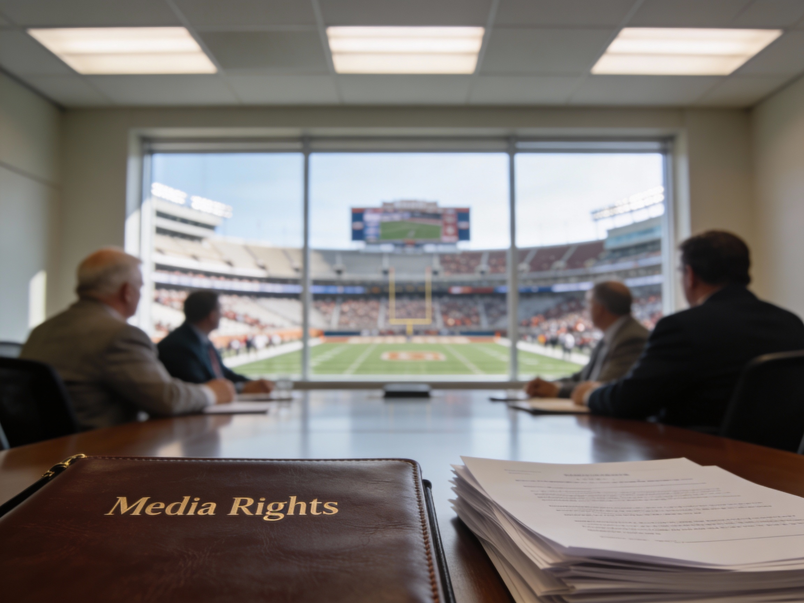

*The traditions lost in American college football vanished long before the inevitable transformation of the modern college athlete into entrepreneur. (generated by Perplexity.ai)*

---

In America, the NCAA college football playoffs are in full swing with the first of the two semifinal games having been played last night. And what a game that was!

The talk this morning on ESPN -- as it inevitably does when discussing college football -- brought up the impact of NIL (Name, Image, and Likeness), which allows college athletes to directly profit as entrepreneurs, and the "transfer portal", which allows college athletes to switch schools from season to season.

I always sneer when someone suggests that NIL and the transfer portal have "ruined The College Game": Where have they been for the past 30-40 years!  The universities' selling of broadcasting rights, or generally media rights, has pumped billions into universities while the college athletes were forbidden to even accept gifts or summer jobs.  After all, why do we celebrate the entrepreneurship of the likes of Michael Dell who sold computers out of his college dorm room, maximizing his talents, while demonizing students who attempt to profit off of their talents during those same college years? Moreover, colleges abandoned long-cherished conference rivalries to jump into mega-conferences, dissolving decades-old traditional conferences, in order to chase a larger share of the ever-growing pie commanded by those media rights. While coaches have been breaking contracts on an annual basis, abandoning athletes they recruited into their colleges, for even more money decades before the removal of restrictive transfer rules that confined those athletes to the schools that were abandoned. 

And, ... well, I could go on and on ....

But, I have my own biases born from family ties to the sport and first-hand witnessing as a former NCAA Division I athlete myself.  So, I turned to an intellectually honest oracle for its take on the topic.

---

**The research topic:**

> **_"The traditions of NCAA Division I American college football -- amateur 'student-athletes', athletes & coaches loyal to the universities, school rivalries -- were destroyed by colleges & coaches chasing (TV) money many years before NIL and the transfer portal.'."_**

**The upshot:** Facts is facts: today's college game is the inevitable culmination of big-money forces set in motion decades ago.

---

Below is the plain-language synopsis of the BFIH findings, which includes a link to the full BFIH analysis report with bibliography.

⁂



---

Thank you for your time and mindshare,

-Michael L. Thompson ([LinkedIn profile](https://www.linkedin.com/in/mlthomps))

⁂

