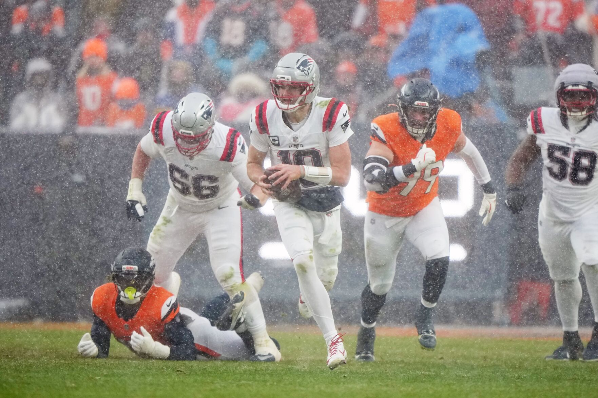

*New England Patriots quarterback Drake Maye runs the ball in the fourth quarter against the Denver Broncos during the AFC championship game Sunday [January 25, 2026] in Denver. (__Bart Young/The Associated Press__; [Santa Fe New Mexican, Jan. 27, 2026](https://www.santafenewmexican.com/ap/sports/tough-coaching-helped-pats-qb-drake-maye-flourish-in-his-second-season/article_a2532d6e-281b-5c32-b64d-ea008ba9bd9f.html))*

---

With the NFL's Super Bowl coming up on Sunday, I couldn't help but marvel at how charmed of a season the New England Patriots have had -- not too unlike that of the 2021-2022 Cincinnati Bengals.  To me, it seemed like everything fell their way. Sure they're a solid team but 14-3 regular season solid? AFC Champions solid?!

Well, what better topic to sic the [**BFIH Tournament** app](https://bfih-game2-711582453480.us-east5.run.app/) on. Especially because, with the help of Claude Code, I've improved some of its inner workings.

---

**The proposition to analyze:**

> **_"The 2025-2026 New England Patriots had an extraordinarily fortuitous path -- soft schedule, weak division, injury-depleted opponents, exceptionally uninjured & available starters, fortuitous close-game endings, etc. -- to Super Bowl LX."_**

**The upshot:** Sure, luck played a part -- it always does in a championship season -- but they were good, too. And that's the way the NFL likes it....

---

Below is the plain-language synopsis of the BFIH findings, which includes a link to the full BFIH analysis report.

⁂



---

Thank you for your time and mindshare,

-Michael L. Thompson ([LinkedIn profile](https://www.linkedin.com/in/mlthomps))

⁂

