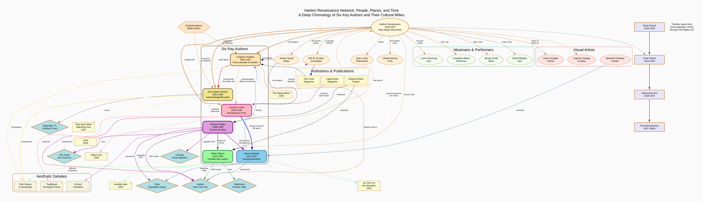

*[Alain Locke](https://www.harvardmagazine.com/2018/02/alain-locke-the-new-negro), the "Dean" of the Harlem Renaissance, ca. 1930. ([Wikipedia.org](https://en.wikipedia.org/wiki/Alain_LeRoy_Locke))*

---

**Latest on the _Bayesian Framework of Intellectual Honesty (BFIH)_:** I've been working on several revamps of the core methodological engine of the BFIH analysis. Instrumental in this has been Anthropic's Claude Code (Opus 4.6). It has allowed me to make several specialized versions of BFIH:

- 'lite' analysis,
- predictive forecasting,
- synthesis of a network of multiple interdependent analyses.

And to leverage scripted parallelized investigations of multiple propositions and perform ablation studies with parallelized Monte Carlo simulation.

This is all to say that when I turned the BFIH analysis on a subject dear to me -- the Harlem Renaissance -- I went deep down the rabbit hole. 

---

**Today's Topic:** I picked [the Harlem Renaissance](https://www.britannica.com/summary/Harlem-Renaissance-Timeline) because it is special to me. I discovered it in high school roughly 50 years ago in the school's library. I've forgotten the exact when and who I read first but I remember ravenously reading Langston Hughes and Zora Neale Hurston, then James Baldwin, Richard Wright, and Roy Ellison -- all from books I found in this high school library in El Paso, Texas!  

These great authors had a great impact upon me, and were a key influence in my own creative writing, for which I won awards at the district, state, regional and ultimately national level culminating in "Best Short Story" in the 1978 National High School Literary Magazine Contest of the [Columbia Scholastic Press Association (CSPA)](https://www.columbia.edu/cu/cspa/docs/contests-and-critiques/gold-circle-awards/index.html). 

- *The CSPA web site describes their latest competitions and awards, noting that the current awards date from 1982 (4 years after I competed) continuing a tradition of competitions that began long before that. So, I have only [this newspaper article from the El Paso Herald-Post of Nov. 8, 1978](https://drive.google.com/file/d/1lG4wFJWr-uDN2abYrB3XrcJS4lmtzu7e/view?usp=sharing) to document my national recognition. Needless to say, times were different then....*

Having said all that, I'm far from a historian on the subject. To learn more I ran three separate BFIH analyses of this topic, each with a slightly different version of the code.  I was thrilled with the depth and breadth of the results:

- The analysis tied in The Great Migration of Black Americans from the South to the North creating the community within which the Renaissance rose and an audience hungry for literature, art, and music by and about themselves.
- It described the professional infrastructure of editors, publishers, and patrons who helped support and spread the creative output of the creatives.
- It cited a treasure trove of source material digitally and in print for me to dive deeply into.
- And it gave life to the **_scenius_** -- as Brian Eno coined for such creative ecosystems infused in daily interactions co-influencing, competing, and ultimately elevating each other's works, and defying the myth of the singular **_genius_** toiling away brilliantly in solitude.

Although the 3 BFIH analyses came to slightly different hypotheses receiving the highest posterior probability, they all had similar conclusions and takeaways.  In the end, as I've waded through the tons of BFIH output and source material, I'm satisfied that each serves the BFIH purpose well: To shed light upon the topic from several perspectives. For this post, I chose to feature the last of the 3 BFIH analyses.

I also had Perplexity.AI generate a chronology, <a href="{{ site.baseurl }}/assets/harlem_renaissance_chronology_rev.html" target="_blank">"Deep Chronology of Harlem Renaissance Literary Figures: A Network Analysis of Six Key Authors and Their Cultural Milieu"</a>. Plus, I had it generate the visualization shown below. Both the chronology and the visualization are centered around six key authors. 

I can't speak to the accuracy or completeness of either the chronology, the visualization, or the synopsis that follows other than to say they feel right.  **I simply haven't paid the dues of diligent scholarship needed to speak authoritatively on this subject.** So take all of this as a starter sketch to kick you off with the gist of the Harlem Renaissance scenius. But be aware that this post could be misleading with respect to who is and is not emphasized and what creative work is and is not mentioned.  

At any rate, on with the BFIH take.

---

**The proposition to analyze:**

> **_"Was the cultural output of the Harlem Renaissance (1918–1937) primarily a product of a 'scenius' — a unique communal ecology of social and geographic factors — rather than the independent brilliance of individual figures like Langston Hughes and Zora Neale Hurston?"_**

**The upshot:** The Harlem Rennaissance was a scenius powered by geniuses with the support and audience of a vibrant American community!

---

### Synopsis

Below is the plain-language synopsis of the BFIH findings, which includes a link to the full BFIH analysis report.

⁂



---

Thank you for your time and mindshare,

-Michael L. Thompson ([LinkedIn profile](https://www.linkedin.com/in/mlthomps))

⁂

